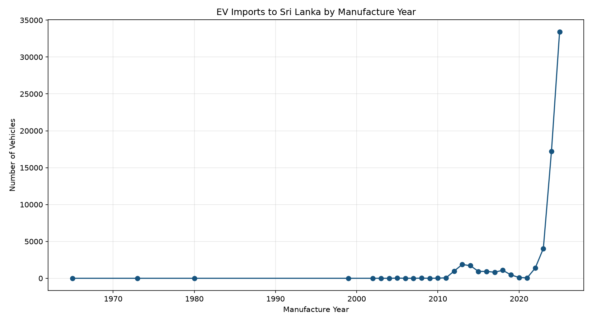
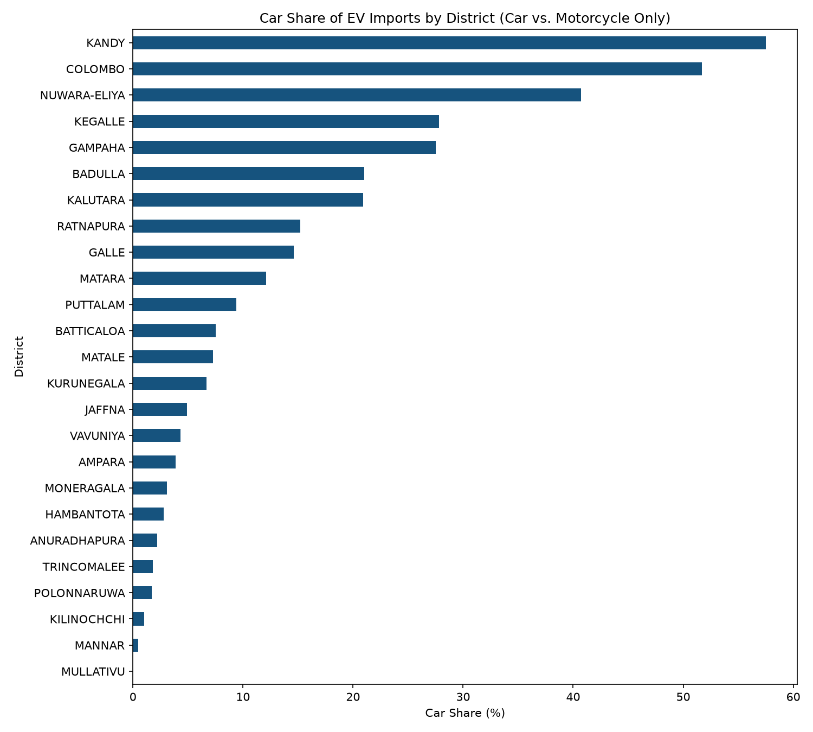

# EV Vehicle Imports in Sri Lanka: Data Analysis

Analysis of electric vehicle (EV) import data from Sri Lanka's Department of Motor Traffic
(DMT), exploring adoption trends by vehicle category, brand, district, and time — including
data cleaning, exploratory analysis, forecasting, and clustering.

## Project Overview

Sri Lanka has seen a dramatic recent surge in EV imports. This project cleans and analyzes
6,536 aggregated import records (65,197 total vehicles, 2011–2025) to answer:

- What types of EVs are being imported, and by whom?
- How has EV adoption changed over time, and where might it be headed?
- Are there regional differences in EV adoption patterns across Sri Lanka's 25 districts?

## Key Findings

- **Motorcycles dominate**: ~79% of all EV imports are motorcycles, led overwhelmingly by
  a single brand, **YADEA** (~45% of total market share).
- **Explosive recent growth**: EV imports grew from 4,041 (2023) to 33,418 (2025) — roughly
  an 8x increase in two years. A simple linear forecast trained on the full 2011–2025
  history underestimates 2026 by nearly 3x compared to a model trained on the recent trend
  alone, highlighting how new and volatile this growth phase is.
- **Regional adoption patterns cluster into 3 groups** (via k-means): a small car-leaning
  group (Colombo, Kandy, Nuwara-Eliya), a large motorcycle-dominant group (mostly North/East
  and dry-zone districts), and a moderate-mix middle tier (mostly Western/Southern
  districts).




## Data Source

Raw data provided by Sri Lanka's Department of Motor Traffic (DMT). Each row represents an
aggregated count of vehicles by category, make, model, manufacture year, and district (not
one row per individual vehicle).

## Repository Structure

ev-sri-lanka-analysis/
├── data/
│ ├── raw/ # original untouched data
│ └── processed/ # cleaned dataset
├── notebooks/
│ ├── 01_data_cleaning.ipynb
│ └── 02_eda.ipynb
├── src/
│ └── cleaning.py # reusable data cleaning functions
├── visuals/ # exported chart images
├── requirements.txt
└── README.md

## Methodology

1. **Data Cleaning**: fixed a district name typo, resolved 12 implausible/missing
   manufacture years, standardized and merged brand name inconsistencies using fuzzy string
   matching (verified against model names before merging).
2. **Exploratory Data Analysis**: category distribution, top makes, district totals.
3. **Advanced Analysis**:
   - Time-series trend analysis and linear regression forecasting (with an honest
     comparison of long-term vs. short-term trend models)
   - Geographic category-mix analysis (car vs. motorcycle share by district)
   - K-means clustering of districts by EV category adoption profile

## Tech Stack

Python, pandas, numpy, matplotlib, seaborn, scikit-learn, statsmodels, Jupyter

## How to Run

```bash
git clone https://github.com/kaushalsenevirathna/ev-sri-lanka-analysis.git
cd ev-sri-lanka-analysis
python -m venv .venv
.venv\Scripts\Activate.ps1   # Windows
pip install -r requirements.txt
```
Then open the notebooks in `notebooks/` in VS Code or Jupyter, in order (01 → 02).

## Author

Kaushal Senevirathna — [https://www.linkedin.com/kaushalsenevirathna] · [https://github.com/kaushalsenevirathna]